# Manual de uso — Oporto Residencial

**Destinatario:** Administración del conjunto  
**Propósito:** Explicar, de forma clara y con capturas reales del sistema, qué se puede hacer en cada módulo según el perfil de usuario.  
**Aplicación en línea:** [https://oporto-residencial-production.up.railway.app](https://oporto-residencial-production.up.railway.app)

---

## 1. ¿Qué es Oporto Residencial?

Es la plataforma digital del conjunto para gestionar en un solo lugar:

- Residentes y sus accesos
- Visitas (con vehículo o mascota)
- Reservas de zonas comunes
- Mantenimiento y pagos
- Anuncios / comunicados
- Vigilantes y turnos
- Correspondencia / paquetes
- Historial de auditoría y notificaciones

La aplicación se usa desde el navegador (computador o celular). Cada persona ve **solo los menús que corresponden a su perfil**.

---

## 2. Cómo ingresar

Al abrir la plataforma aparece la pantalla de inicio de sesión.

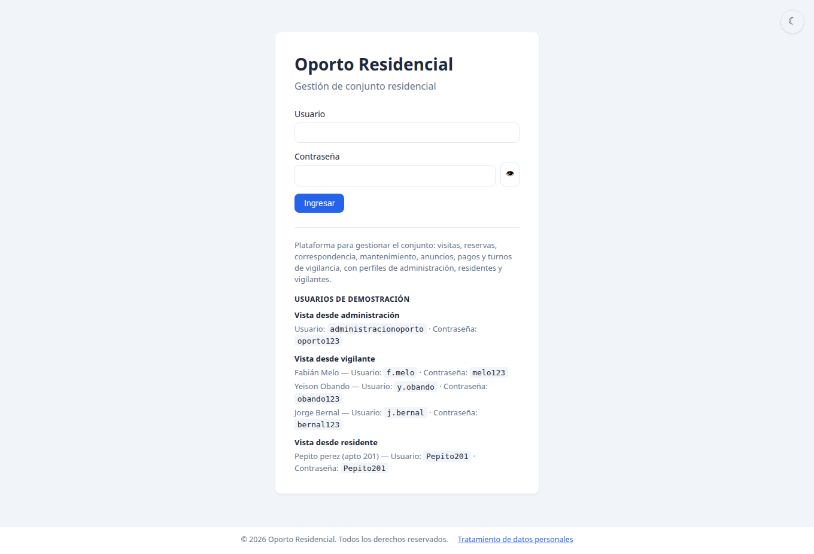

1. Escriba su **usuario** y **contraseña**.
2. Pulse **Ingresar**.
3. La primera vez (o cuando se reinicia la contraseña de un residente) puede aparecer el aviso de **tratamiento de datos personales**; debe leerlo y aceptar para continuar.
4. En la esquina superior puede cambiar entre **tema claro / oscuro**.

### Usuarios de referencia (demostración)

| Perfil | Usuario | Contraseña |
|--------|---------|------------|
| Administración | `administracionoporto` | `oporto123` |
| Vigilante | `f.melo` | `melo123` |
| Vigilante | `y.obando` | `obando123` |
| Vigilante | `j.bernal` | `bernal123` |
| Residente (apto 201) | `Pepito201` | `Pepito201` |

> **Nota:** Los residentes nuevos se crean desde Administración. Al crearse reciben una contraseña temporal y el sistema les pide cambiarla en el primer ingreso.

---

## 3. Elementos comunes en toda la aplicación

Luego de ingresar verá siempre:

- **Nombre del conjunto** y el perfil con el que está conectado
- **Menú de módulos** (cambia según el perfil)
- **Campana de notificaciones** (avisos de visitas, reservas, correspondencia, anuncios, etc.)
- **Cambiar tema** (claro / oscuro)
- **Cerrar sesión**
- Enlace de **Tratamiento de datos personales** en el pie de página

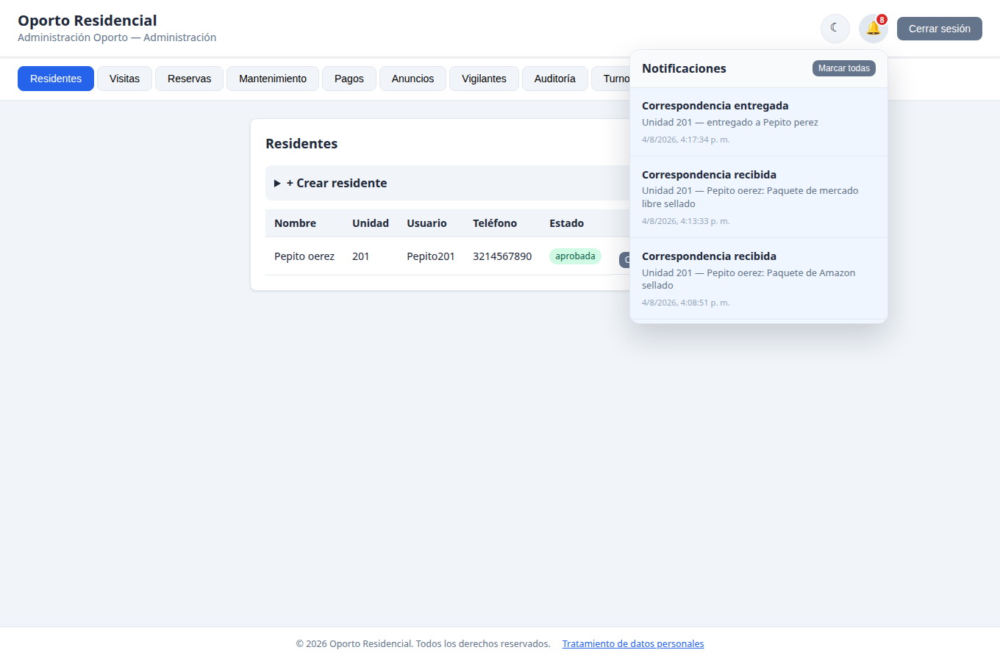

Desde notificaciones puede:

- Ver avisos recientes
- Abrir el módulo relacionado al tocar un aviso
- Usar **Marcar todas** para dejarlas como leídas

---

# 4. Perfil Administración

Este es el perfil principal para la administradora del conjunto.  
Menú disponible:

**Residentes · Visitas · Reservas · Mantenimiento · Pagos · Anuncios · Vigilantes · Auditoría · Turnos · Correspondencia**

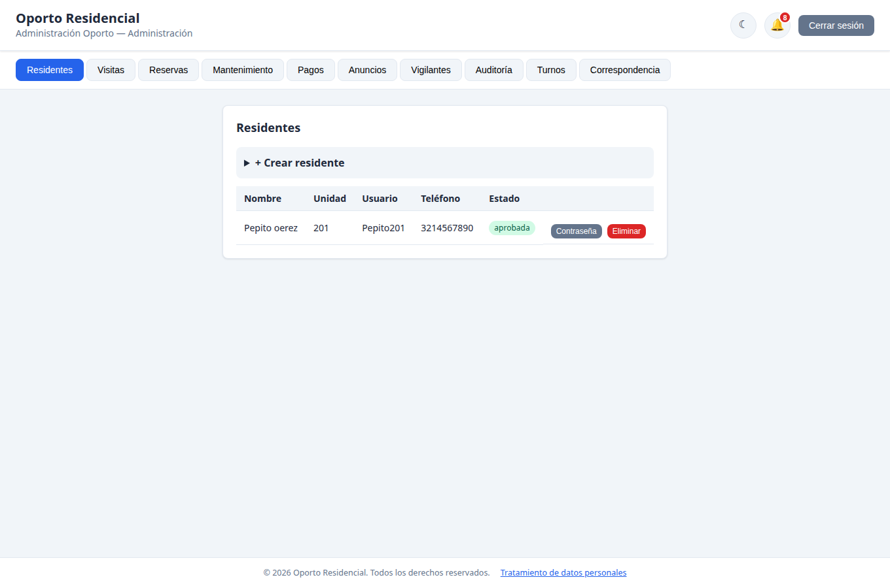

---

## 4.1 Residentes

**Para qué sirve:** dar de alta a las personas del conjunto y controlar su acceso a la plataforma.

### Qué puede hacer

| Acción | Descripción |
|--------|-------------|
| Ver listado | Nombre, unidad, usuario, teléfono y estado |
| Crear residente | Abre el formulario “+ Crear residente” |
| Reiniciar contraseña | Asigna una contraseña temporal nueva |
| Eliminar | Quita el residente del sistema |

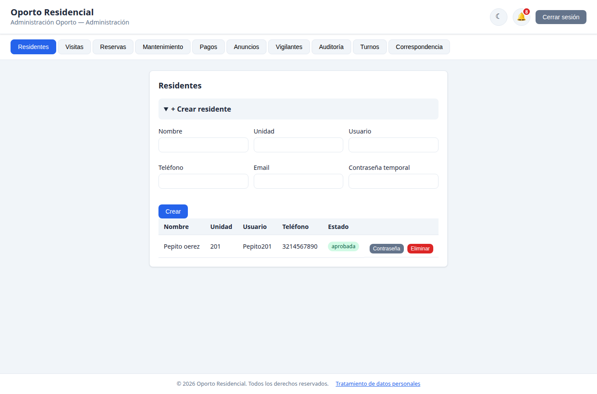

### Datos al crear un residente

- Nombre  
- Unidad (apartamento)  
- Usuario (con el que iniciará sesión)  
- Teléfono  
- Email  
- Contraseña temporal  

### Reglas importantes

- Al crear o reiniciar contraseña, el residente **debe cambiarla** en el primer ingreso.
- La contraseña nueva del residente debe tener: mínimo 6 caracteres, al menos 1 mayúscula y 1 número.
- El nombre de usuario no se puede repetir.

---

## 4.2 Visitas

**Para qué sirve:** consultar todas las visitas del conjunto y, si es necesario, registrar una visita manualmente.

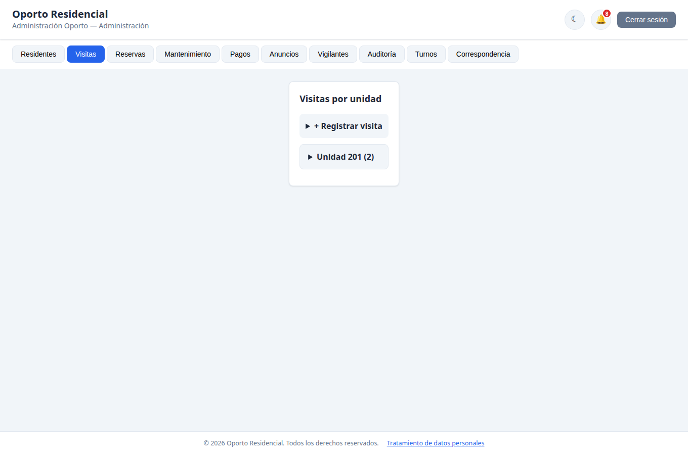

### Qué puede hacer

- Ver visitas agrupadas por unidad
- Registrar una visita (unidad, visitante, documento, propósito)
- Consultar si hay mascota, foto o firma (cuando aplique)
- Eliminar visitas solo si el usuario es **Super Admin** (la administración normal no tiene esta opción)

### Estados de una visita

1. **pendiente** — programada, aún no ingresa  
2. **ingreso** — el vigilante ya registró la entrada  
3. **despachado** — el vigilante registró la salida  

> En la operación diaria, quien marca **Ingreso** y **Despachado** es el **vigilante**. Administración supervisa y puede registrar visitas cuando haga falta.

---

## 4.3 Reservas

**Para qué sirve:** revisar las reservas de zonas comunes y **aprobar o rechazar** las que lo necesiten.

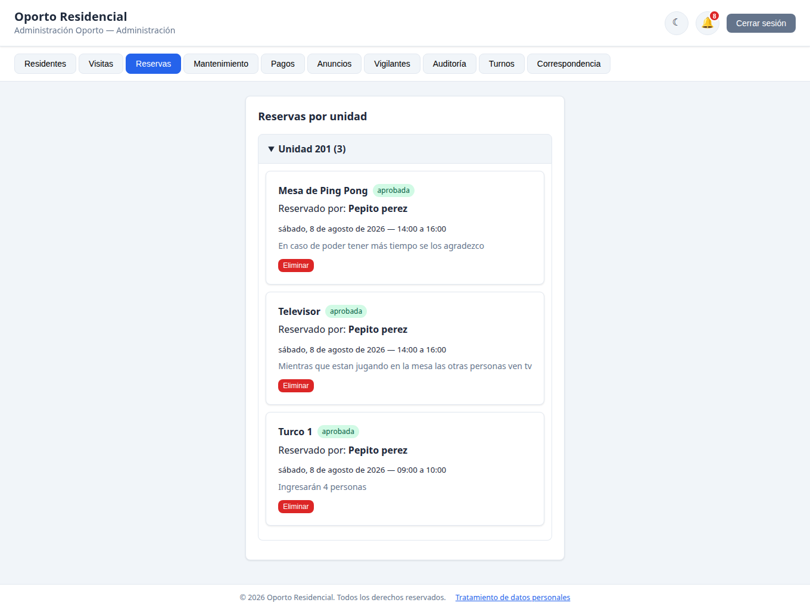

### Qué puede hacer

- Ver reservas por unidad
- **Aprobar** reservas pendientes
- **Rechazar** reservas pendientes
- Eliminar una reserva

### Reglas de áreas

| Tipo | Áreas | Comportamiento |
|------|-------|----------------|
| Aprobación automática | Turco 1, Turco 2, Televisor, Mesa de Ping Pong | Quedan aprobadas al crearlas |
| Requieren aprobación / depósito | Salón social, Kiosco 1, Kiosco 2, Kiosco 3 | Quedan pendientes hasta que administración decida |

### Otras reglas

- No se permiten horarios cruzados en la misma área y fecha.
- La hora de fin debe ser posterior a la de inicio.
- Al aprobar o rechazar, el sistema notifica al residente y a vigilancia.

---

## 4.4 Mantenimiento

**Para qué sirve:** registrar y hacer seguimiento a novedades o fallas del conjunto.

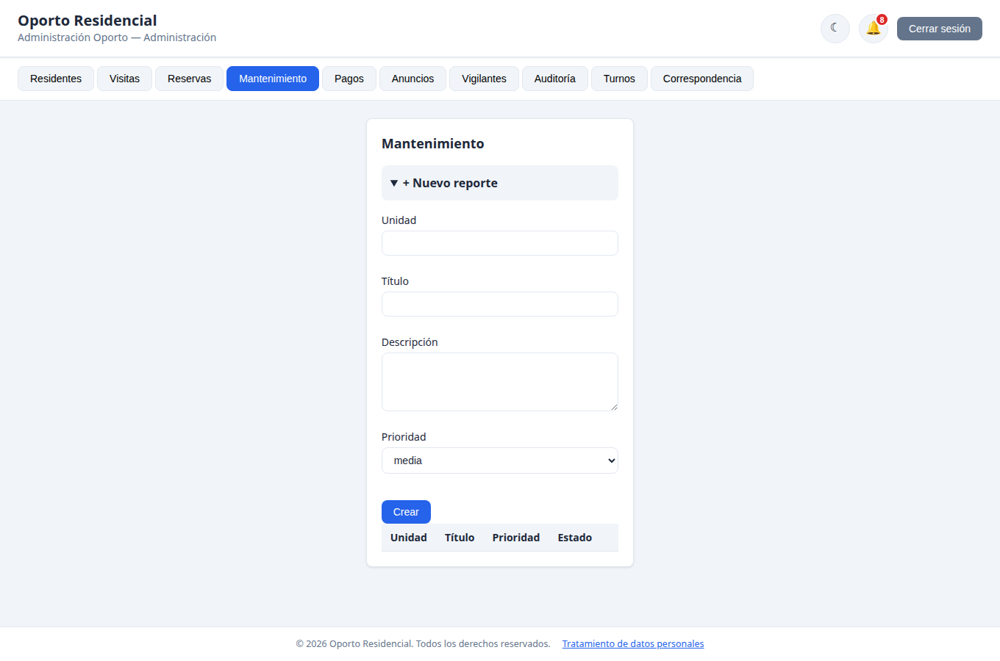

### Qué puede hacer

- Crear reporte (unidad, título, descripción, prioridad)
- Ver el listado de reportes
- Cambiar el estado: **abierto → en proceso → cerrado**

Prioridades disponibles: **baja**, **media**, **alta**.

---

## 4.5 Pagos

**Para qué sirve:** llevar el control de cobros / cuotas por unidad.

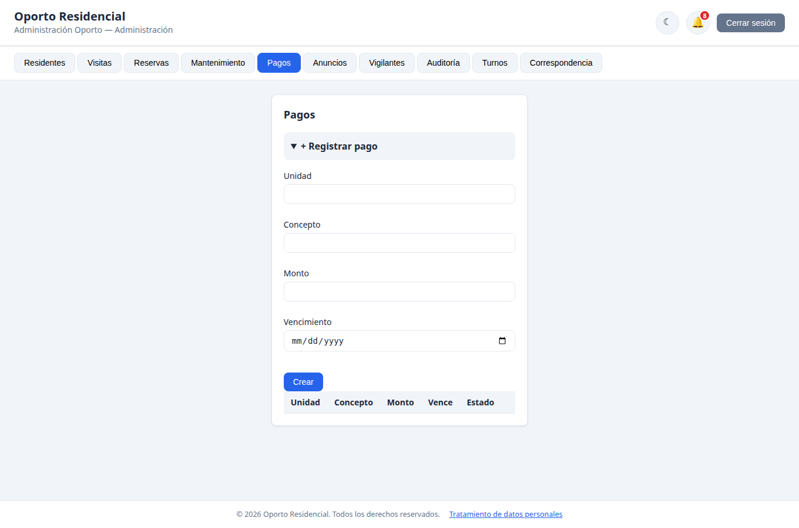

### Qué puede hacer

- Registrar un pago o cobro (unidad, concepto, monto, vencimiento)
- Marcar un registro como **pagado**
- Eliminar un registro

Estado inicial: **pendiente**. Al marcar pagado, el sistema guarda la fecha de pago.

---

## 4.6 Anuncios

**Para qué sirve:** publicar comunicados para residentes y vigilantes.

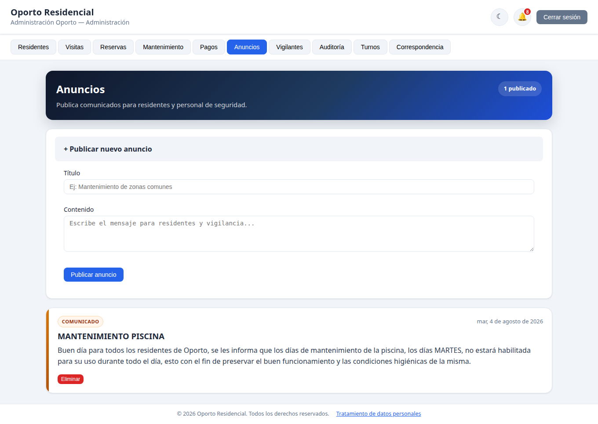

### Qué puede hacer

- Publicar anuncio (título y contenido)
- Ver anuncios publicados
- Eliminar un anuncio

Al publicar, el sistema envía notificación a residentes y vigilantes.

---

## 4.7 Vigilantes

**Para qué sirve:** administrar el personal de seguridad que usa la plataforma.

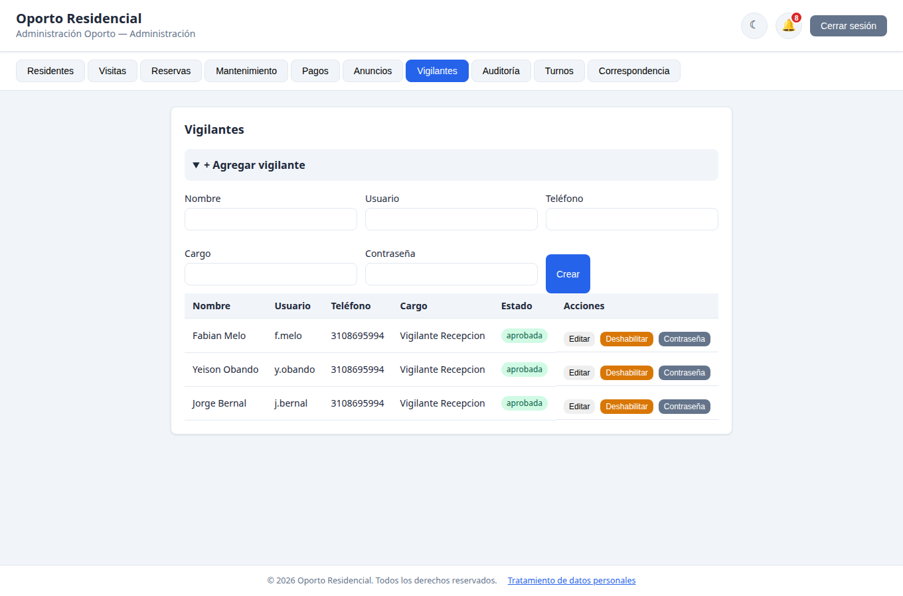

### Qué puede hacer

- Crear vigilante (nombre, usuario, teléfono, cargo, contraseña)
- Editar datos
- Habilitar / deshabilitar
- Cambiar contraseña
- Eliminar (solo **Super Admin**)

### Regla de turno (opcional)

Si en el servidor se activa el control estricto de turnos, un vigilante solo podrá iniciar sesión cuando la malla indique que está de turno. En la configuración actual de demostración, los vigilantes activos pueden ingresar normalmente.

---

## 4.8 Auditoría

**Para qué sirve:** revisar el historial de acciones realizadas en el sistema (trazabilidad).

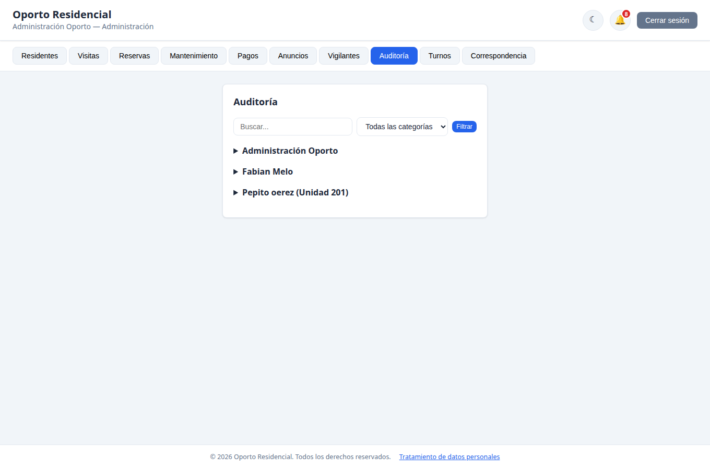

### Qué puede hacer

- Ver registros agrupados por persona
- Buscar por texto
- Filtrar por categoría (autenticación, residentes, visitas, reservas, mantenimiento, anuncios, pagos, vigilantes, correspondencia, turnos)

### Privacidad entre administradores

- La **administración normal** no ve las acciones del **Super Admin**.
- El Super Admin sí puede ver todo el historial.

---

## 4.9 Turnos

**Para qué sirve:** generar y consultar la malla de turnos de vigilancia (día / noche / descanso).

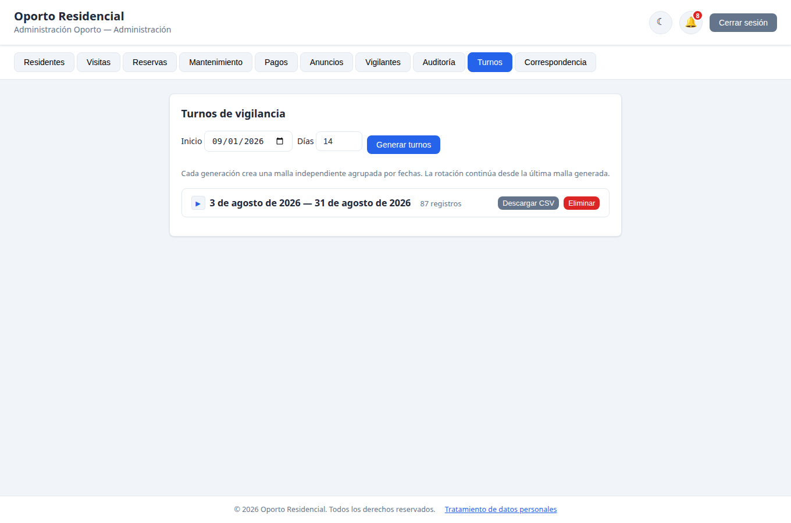

### Qué puede hacer

- Generar una malla (fecha de inicio y cantidad de días)
- Ver turnos por periodo
- Descargar la malla en **CSV**
- Eliminar una malla

### Reglas importantes

- La rotación continúa de forma ordenada desde la última malla.
- No se pueden generar periodos que se crucen entre sí.
- Esta malla también se usa para saber **quién está de turno** al entregar correspondencia.
- Cerca del fin de mes, el sistema puede generar automáticamente la malla del mes siguiente.

---

## 4.10 Correspondencia (vista administración)

**Para qué sirve:** supervisar paquetes / correspondencia registrada para las unidades.

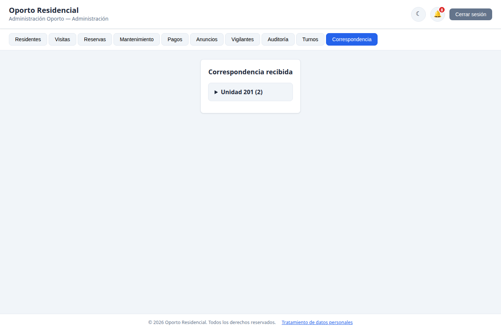

### Qué puede hacer

- Ver correspondencia agrupada por unidad
- Ver foto del paquete (si se adjuntó)
- Ver firma de quien recibió (cuando ya fue entregada)
- **Limpiar todo** el historial solo si es **Super Admin**

> Administración **no registra ni entrega** correspondencia desde este módulo. Eso lo hace el **vigilante** en portería.

Estados: **recibido** → **entregado**.

---

# 5. Perfil Residente

El residente ve únicamente lo relacionado con su unidad.

Menú: **Mis Visitas · Mis Reservas · Correspondencia Recibida · Anuncios**

---

## 5.1 Mis Visitas

**Para qué sirve:** programar visitantes y seguir si ya ingresaron o salieron.

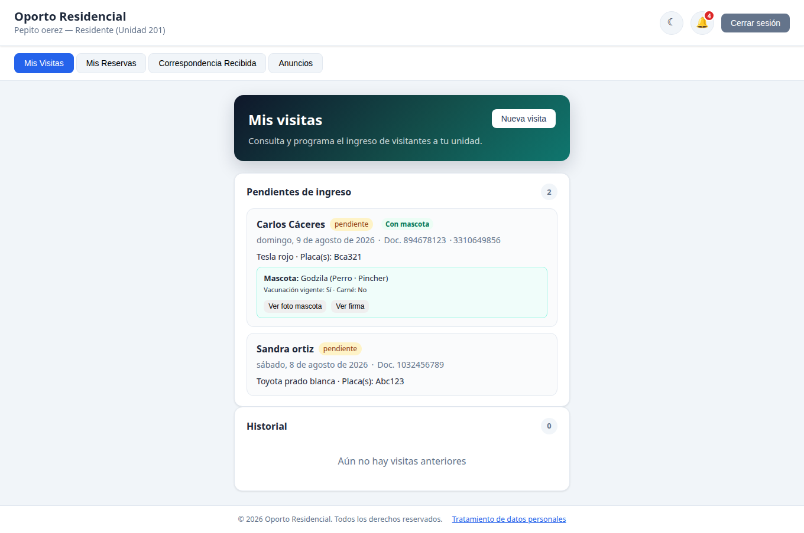

### Qué puede hacer

- Ver visitas **pendientes de ingreso**
- Ver **historial**
- Crear **Nueva visita** desde el calendario
- Consultar foto de mascota y firma (si aplica)

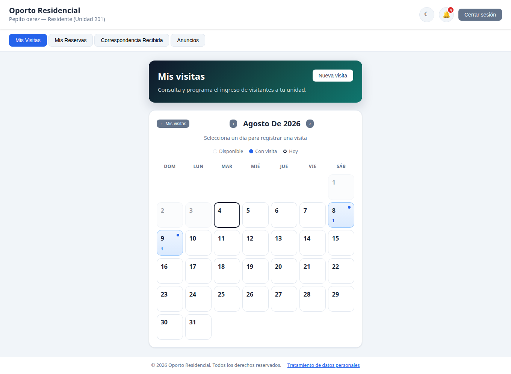

### Datos al registrar una visita

- Fecha  
- Nombre del visitante  
- Número de documento  
- Modelo y placas del vehículo  
- ¿Trae mascota?

Si trae mascota, también pide: teléfono, hora estimada, datos de la mascota, vacunación, compromisos, foto (opcional) y **firma obligatoria** del visitante.

### Reglas

- No se pueden elegir fechas pasadas.
- La visita nace en estado **pendiente**.
- Administración y vigilancia reciben aviso de la nueva visita.
- Cuando vigilancia marca ingreso o despacho, el residente recibe notificación.

---

## 5.2 Mis Reservas

**Para qué sirve:** reservar zonas comunes y ver si fueron aprobadas.

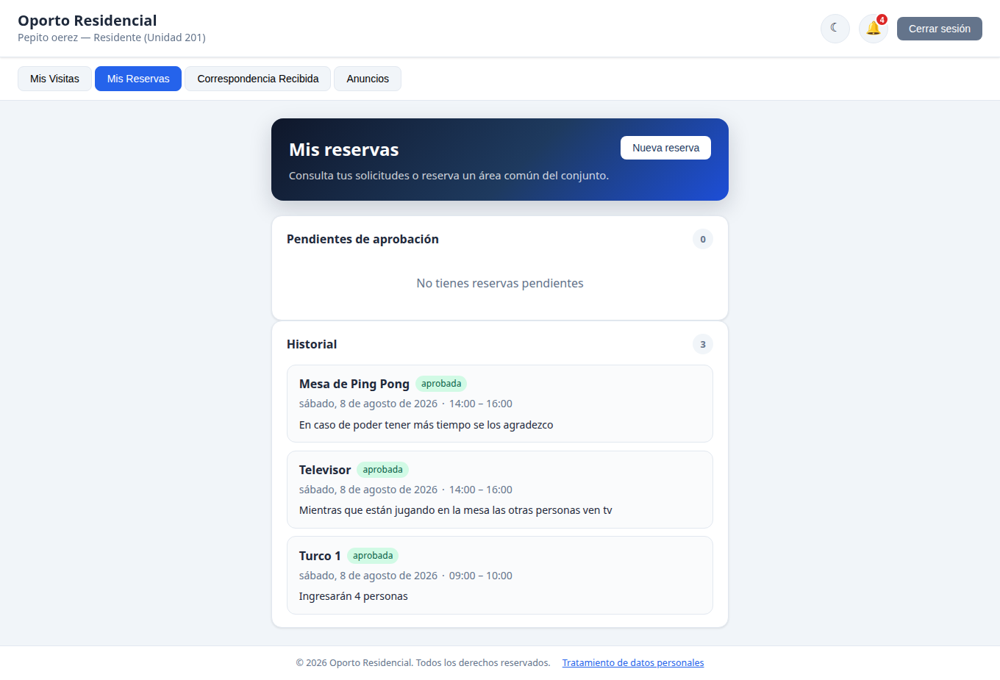

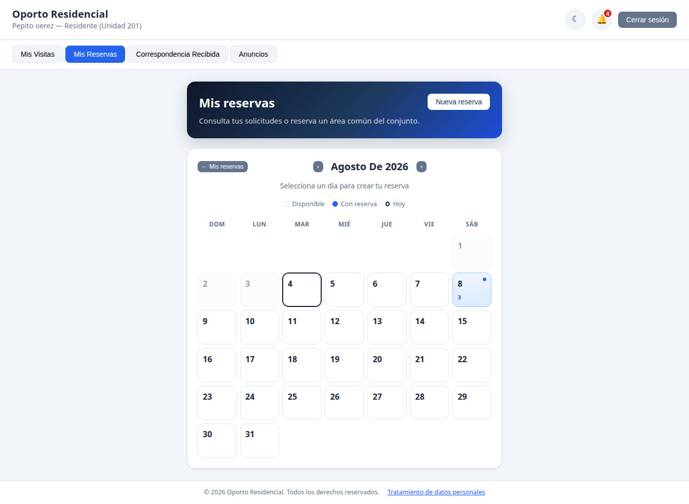

### Qué puede hacer

- Ver reservas pendientes e historial
- Crear **Nueva reserva** (área, fecha, hora inicio, hora fin, nota opcional)

### Reglas

- No se reservan fechas pasadas.
- No se cruza horario en la misma área.
- Algunas áreas se aprueban solas (turcos, televisor, ping pong).
- Salón social y kioscos quedan **pendientes** hasta que administración apruebe o rechace.
- El residente **no** aprueba ni rechaza; solo solicita.

---

## 5.3 Correspondencia Recibida

**Para qué sirve:** saber si llegó un paquete o correspondencia a su unidad.

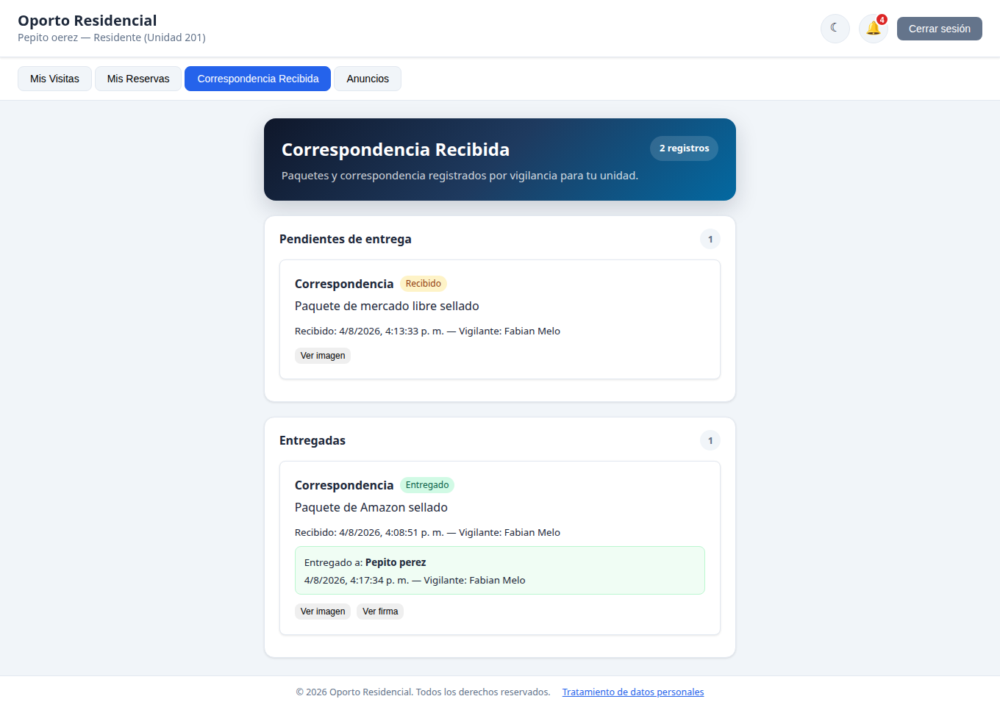

### Qué puede hacer

- Ver pendientes de entrega y ya entregadas
- Ver foto del paquete
- Ver firma de quien lo recibió (cuando ya fue entregado)

Solo ve la correspondencia de **su unidad / su usuario**.

---

## 5.4 Anuncios (residente)

**Para qué sirve:** leer los comunicados publicados por administración.

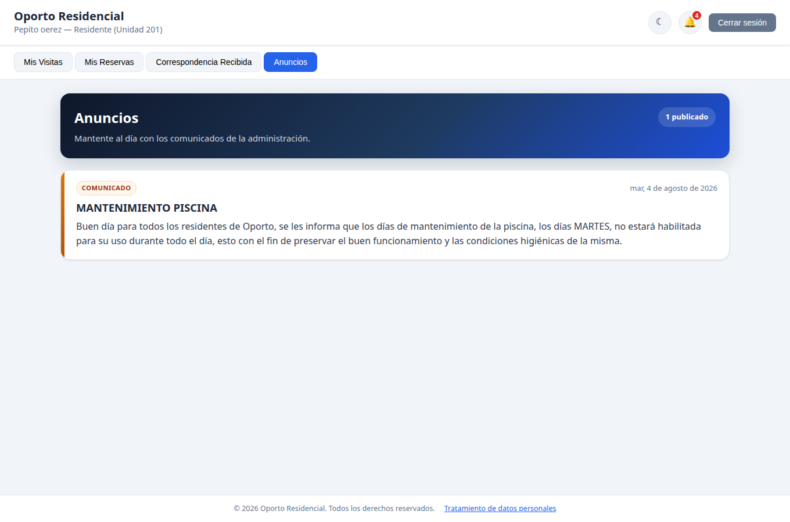

El residente solo lee; no puede crear ni borrar anuncios.

---

## 5.5 Cambio obligatorio de contraseña (residente)

Si administración creó o reinició la clave, al ingresar aparece la pantalla **Cambia tu contraseña**.

Debe indicar:

- Contraseña antigua (temporal)
- Contraseña nueva (mínimo 6 caracteres, 1 mayúscula y 1 número)

Después de guardarla, la sesión se cierra y debe volver a ingresar con la nueva clave.

---

# 6. Perfil Vigilante (Seguridad)

Pensado para portería / recepción.

Menú: **Anuncios · Visitas · Reservas · Correspondencia · Historial de correspondencia**

En el encabezado puede verse el turno actual, por ejemplo:  
`Fabian Melo — Seguridad — 2 diurno: 07:00 a 18:00`

---

## 6.1 Anuncios (vigilante)

**Para qué sirve:** leer comunicados de administración.

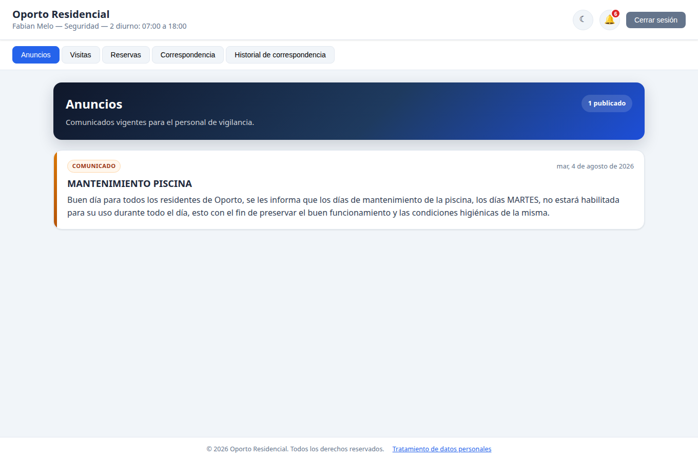

Solo lectura. No crea ni elimina anuncios.

---

## 6.2 Visitas (vigilante)

**Para qué sirve:** controlar el ingreso y salida de visitantes.

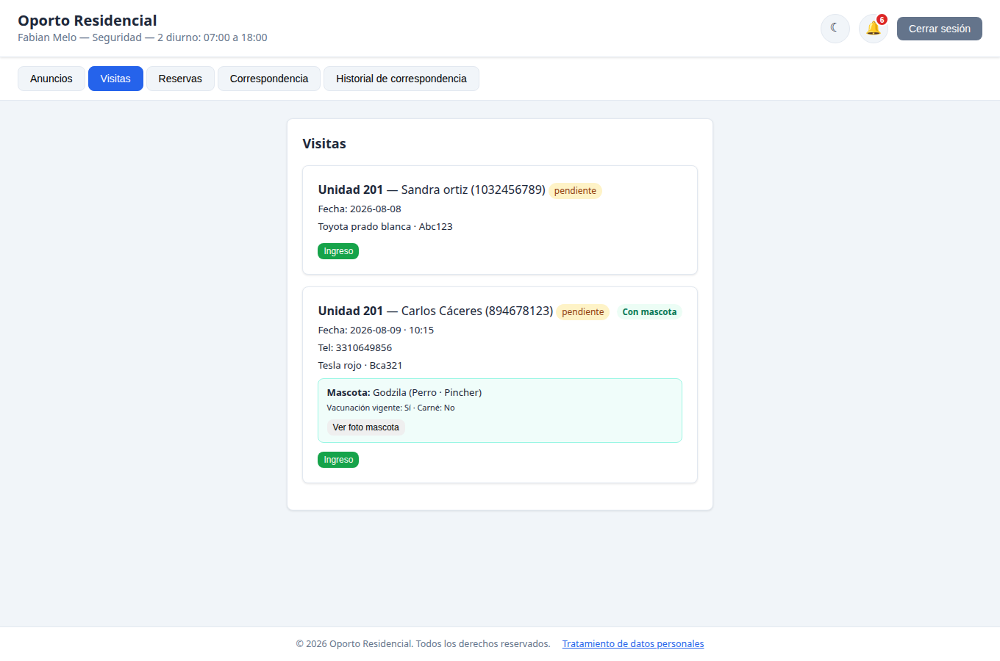

### Qué puede hacer

- Ver todas las visitas
- Pulsar **Ingreso** cuando el visitante está pendiente
- Pulsar **Despachado** cuando ya salió
- Consultar vehículo y datos de mascota (incluida foto)

### Qué no puede hacer

- Crear o eliminar visitas
- Ver la firma del visitante (esa firma la ven administración y el residente)

Cada cambio de estado queda registrado en la línea de tiempo de la visita y genera notificación al residente.

---

## 6.3 Reservas (vigilante)

**Para qué sirve:** consultar qué zonas están reservadas (solo lectura operativa).

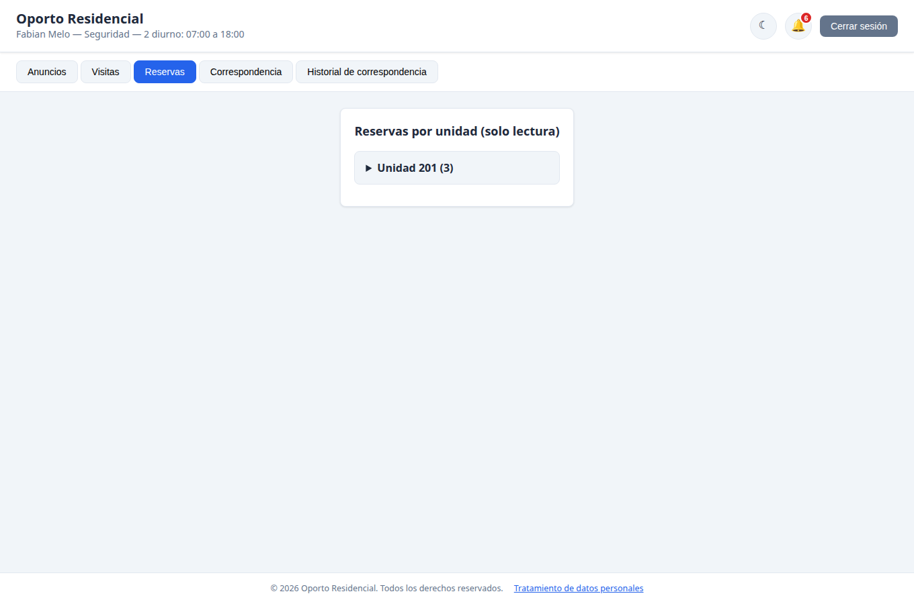

No puede crear, aprobar, rechazar ni eliminar reservas. Recibe notificaciones cuando hay novedades.

---

## 6.4 Correspondencia (registrar)

**Para qué sirve:** cuando llega un paquete a portería, dejarlo registrado para la unidad.

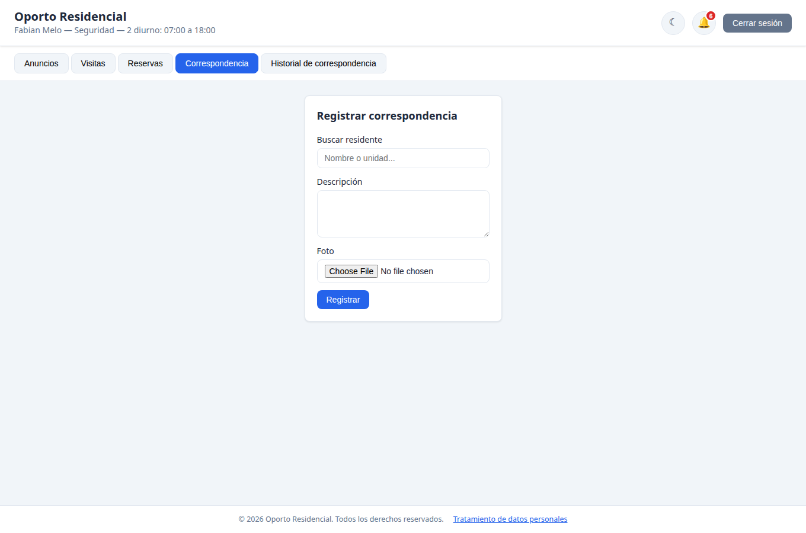

### Pasos

1. Buscar residente (por nombre o unidad; mínimo 2 caracteres)
2. Seleccionarlo
3. Escribir descripción
4. Adjuntar foto (opcional)
5. Pulsar **Registrar**

El estado inicial es **recibido**. Se notifica a administración y al residente.

---

## 6.5 Historial de correspondencia (entregar)

**Para qué sirve:** entregar el paquete a la persona que lo reclama y dejar evidencia.

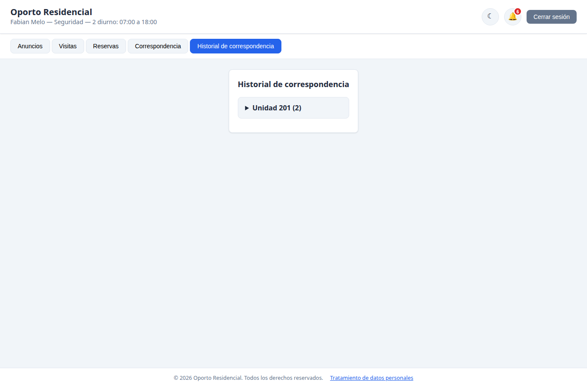

### Al entregar se pide

- Nombre de quien recibe  
- Fecha y hora (automática)  
- Vigilante que entrega (según el turno activo en la malla)  
- **Firma obligatoria** de quien recibe  

### Reglas

- No se puede entregar dos veces la misma correspondencia.
- Debe existir un vigilante en turno según la malla.
- Administración y residente reciben notificación de la entrega.
- El vigilante no vuelve a ver la firma; administración y residente sí.

---

# 7. Resumen rápido por perfil

| Módulo | Administración | Vigilante | Residente |
|--------|----------------|-----------|-----------|
| Residentes | Crear, contraseña, eliminar | — | — |
| Visitas | Ver / registrar | Marcar ingreso y despacho | Crear y ver las de su unidad |
| Reservas | Aprobar / rechazar / eliminar | Solo ver | Solicitar y ver las suyas |
| Mantenimiento | Crear y cambiar estado | — | — |
| Pagos | Crear, marcar pagado, eliminar | — | — |
| Anuncios | Publicar / eliminar | Solo leer | Solo leer |
| Vigilantes | CRUD / habilitar | — | — |
| Auditoría | Consultar | — | — |
| Turnos | Generar / exportar / eliminar | — | — |
| Correspondencia | Supervisar | Registrar y entregar | Ver la de su unidad |
| Notificaciones | Sí | Sí | Sí |

---

# 8. Recomendaciones para la administradora

1. **Empiece por Residentes:** cree cada unidad con usuario y contraseña temporal, y comuníqueselos al residente.
2. **Revise Reservas pendientes** a diario (salón social y kioscos).
3. **Use Anuncios** para comunicados oficiales; llegan por notificación.
4. **Mantenga actualizada la malla de Turnos**; afecta la entrega de correspondencia.
5. **Consulte Auditoría** cuando necesite saber quién hizo un cambio.
6. **No comparta** las claves de administración. Cada perfil debe usar su propio usuario.
7. En celular, use el menú (ícono de tres líneas) para cambiar de módulo.

---

## 9. Soporte de capturas

Todas las imágenes de este manual fueron tomadas directamente de la aplicación en producción:

`https://oporto-residencial-production.up.railway.app`

Carpeta de imágenes: `docs/manual-administradora/imagenes/`

---

*Documento generado para revisión de Administración — Oporto Residencial © 2026*
